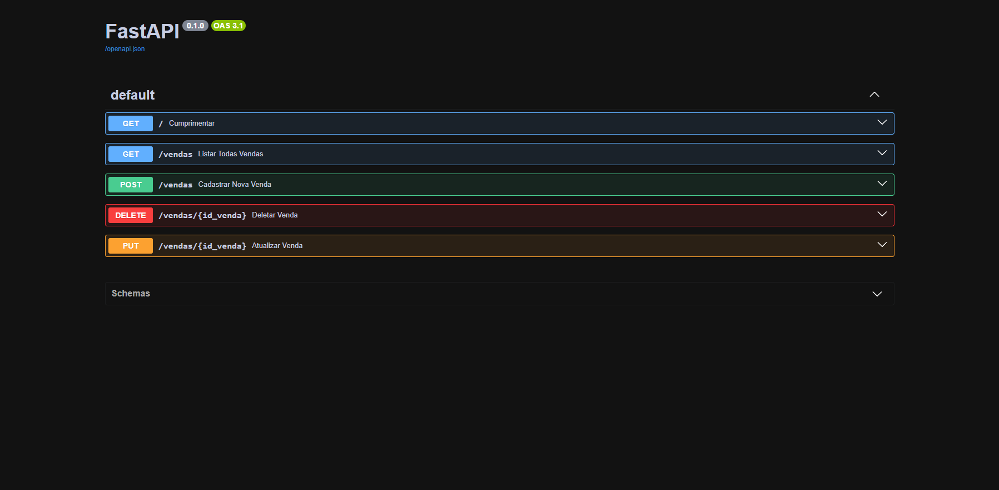
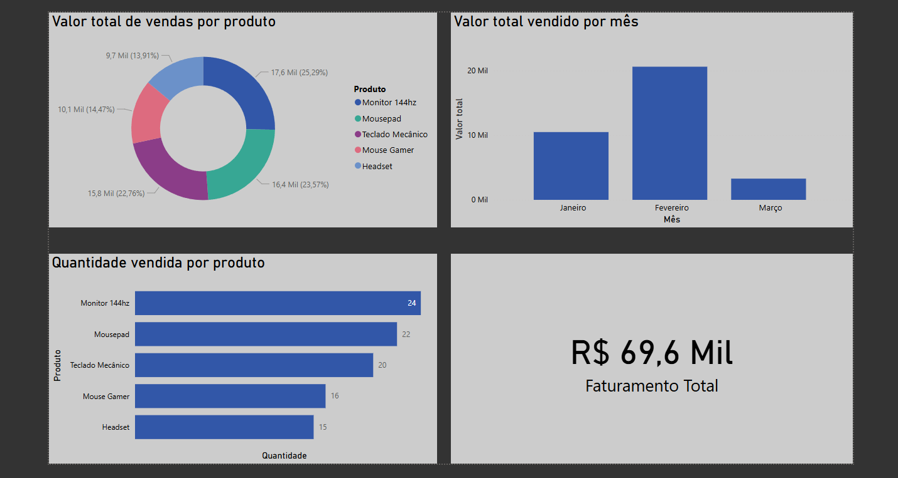

# Ponto de Venda (PDV) - Python + MySQL + PowerBI + FastAPI

Sistema de Ponto de Venda desenvolvido em Python com integração ao MySQL para registro e análise de vendas.
Este projeto simula um pequeno sistema comercial com funcionalidades de cadastro, listagem, remoção, análise de vendas, processamento de dados com Pandas e agora conta com uma **API RESTful**.

## Funcionalidades

* Cadastro, listagem, atualização e remoção de vendas (CRUD completo)
* Interface via Terminal e via Web (API)
* Cálculo automático do valor total (quantidade × valor)
* Resumo analítico com:
  * Total geral vendido
  * Ticket médio
  * Produto mais vendido
  * Vendas agrupadas por data

## Tecnologias Utilizadas

* **Python** (Linguagem principal)
* **MySQL** (Banco de dados relacional)
* **Pandas** (Análise e manipulação de dados)
* **PowerBI** (Dashboard e visualização)
* **FastAPI** (Desenvolvimento da API RESTful)
* **Uvicorn** (Servidor Web)
* **Pydantic** (Validação de dados via JSON)

## Estrutura do Projeto

* `database.py` → Conexão com o banco de dados
* `crud.py` → Operações de banco de dados (Terminal e API)
* `analytics.py` → Métricas e análises com Pandas
* `main.py` → Menu principal (Modo Terminal)
* `api.py` → Rotas da API RESTful (Modo Web)
* `database.sql` → Script de criação do banco

## Como rodar o projeto

### 1. Instalar dependências

```bash
pip install mysql-connector-python pandas fastapi uvicorn pydantic
```

### 2. Criar o banco de dados

Executar o arquivo `database.sql` no seu servidor MySQL.

### 3. Configurar acesso ao banco

Editar o arquivo `database.py` com seu usuário, senha e porta do MySQL.

### 4. Executar o sistema no Terminal (Tradicional)

```bash
python main.py
```

### 5. Executar a API Web (FastAPI)

Para subir o servidor e testar o Backend de forma interativa (Swagger UI), rode o comando na mesma pasta do projeto:

```bash
uvicorn api:app --reload
```

*Após rodar, acesse no seu navegador:* `http://127.0.0.1:8000/docs`

.

## Dashboard de Vendas (Power BI)

Neste projeto, além do backend em Python e da base de dados MySQL, desenvolvi um painel de gestão no Power BI ligado diretamente à base de dados para analisar métricas de faturação e volume de vendas.


