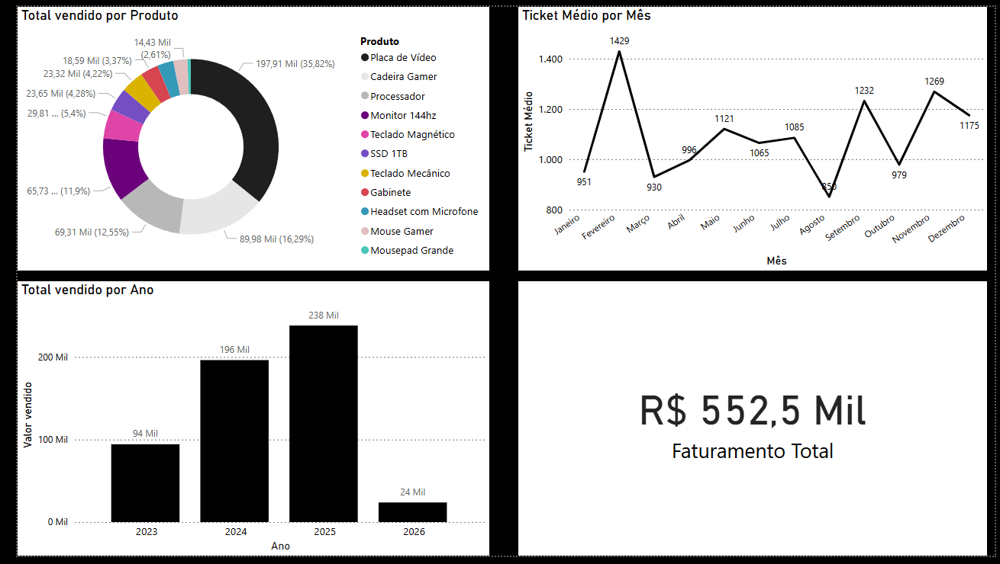

<div align="center">

# 🛒 Ponto de Venda | Full Cycle Data & API

[](https://www.python.org/)
[](https://fastapi.tiangolo.com/)
[](https://www.mysql.com/)
[](https://pandas.pydata.org/)
[](https://powerbi.microsoft.com/)

---

## 📈 Dashboard de Gestão Comercial


*(Interface desenvolvida para análise de faturamento real, ticket médio e performance de estoque via DirectQuery/Import no MySQL).*

</div>

---

## 💡 Sobre o Projeto

<div align="justify">

Este é um ecossistema comercial completo que simula a operação de um Ponto de Venda (PDV) moderno. O projeto foi desenvolvido com uma **arquitetura modular**, separando as responsabilidades de banco de dados, lógica de negócio (CRUD), análise de dados e interface de API.

O sistema oferece três frentes de atuação:
1. **Interface CLI:** Gestão operacional direta via terminal para controle rápido de estoque e vendas.
2. **Camada de API:** Backend em FastAPI com documentação Swagger, permitindo integrações externas e escalabilidade.
3. **Business Intelligence:** Storytelling e análise de métricas no Power BI para suporte à decisão gerencial.

</div>

---

## 📂 Estrutura Modular do Sistema

<div align="justify">

* **`database.py` & `database.sql`**: Camada de persistência. Configuração e estrutura do banco MySQL.
* **`crud.py`**: Lógica principal de persistência (Create, Read, Update, Delete) consumida tanto pelo terminal quanto pela API.
* **`api.py`**: Exposição dos serviços para a web via FastAPI e validação de dados com Pydantic.
* **`analytics.py`**: Engine de Business Intelligence. Processamento de métricas e BI utilizando Pandas.
* **`gerar_dados.py`**: Script de automação para criação de massa de dados realista (500+ registros).
* **`main.py`**: Ponto de entrada (Entry Point) para operação via terminal.

</div>

---

## ⚙️ Como Executar

### 1. Instalar dependências
<div align="justify">

```bash
pip install mysql-connector-python pandas fastapi uvicorn pydantic
```

</div>

### 2. Criar o banco de dados
<div align="justify">

Executar o arquivo `database.sql` no seu servidor MySQL.

</div>

### 3. Configurar acesso ao banco
<div align="justify">

Editar o arquivo `database.py` com seu usuário, senha e porta do MySQL.

</div>

### 4. Executar o sistema no Terminal (Tradicional)
<div align="justify">

```bash
python main.py
```

</div>

### 5. Executar a API Web (FastAPI)

Para subir o servidor e testar o Backend de forma interativa (Swagger UI), rode o comando na mesma pasta do projeto:

```bash
uvicorn api:app --reload
```

*Após rodar, acesse no seu navegador:* `http://127.0.0.1:8000/docs`

---

## 🖥️ Preview da API (Swagger UI)

<div align="center">


</div>

---

<div align="center">

🚀 **Desenvolvido por [Pedro Oliveira Sampaio](https://www.linkedin.com/in/pedro-oliveira-sampaio-0b5469387/)**

</div>